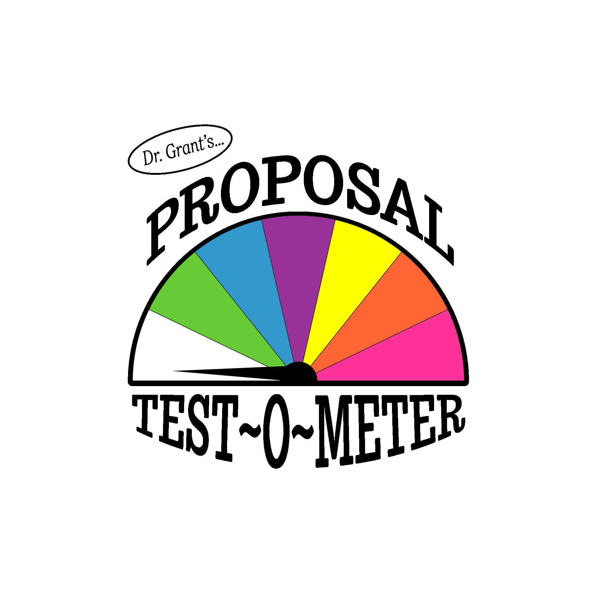

# dr-grants-proposal-test-o-meter
How attractive is your research proposal to potential sponsors?  Let's find out!



## Installation
```
git clone git@github.com:autonlab/dr-grants-proposal-test-o-meter.git
cd dr-grants-proposal-test-o-meter
conda create --name drgrant --file env.txt
conda activate drgrant
./test.sh
```


## How to Run
```
python main.py -k 5 -o results.csv -p 'We propose to research new methods for verification and validation of artificial intelligence and machien learning models fit to data.'
```
-- or create a file with a prompt you can edit with a text editor --
```
./prompts/tai.sh
```


#### If you want a progress bar for multi-gpu indexing
Edit your site-package file for SentenceTransformers.py by adding:
```
from tqdm import tqdm
```

And add a tqdm function call around line 502-503 (depending on where you place import statement):
```
results_list = sorted([output_queue.get() for _ in tqdm(range(last_chunk_id))], key=lambda x: x[0])
```
